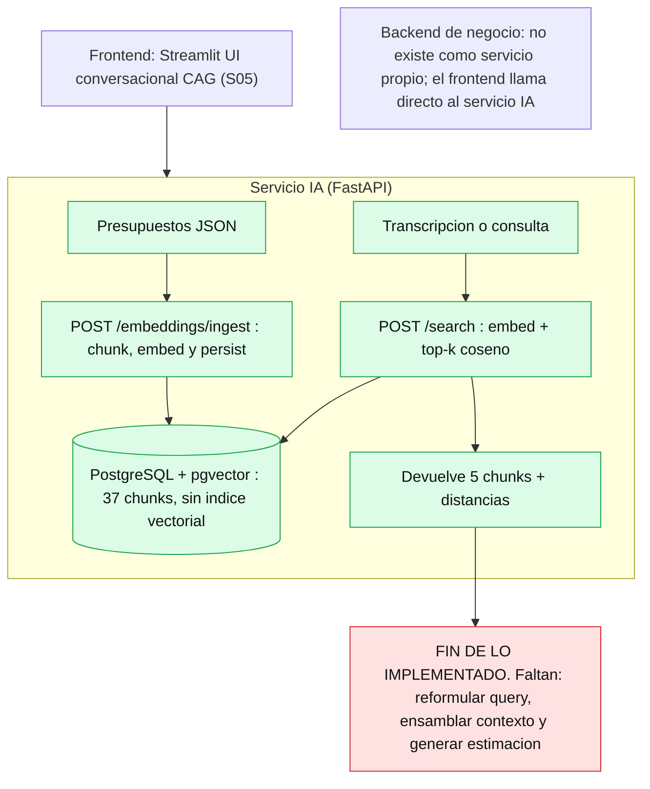
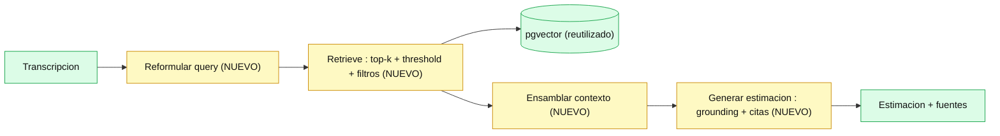

# Diagnóstico arquitectónico — Sesión 09 (pre-work)

> Estado del servicio IA al cierre de la Sesión 08 y diagnóstico de por qué todavía no convierte
> una transcripción de reunión en una estimación fundamentada. Observaciones en español; comandos,
> payloads y nombres de campo en inglés.
>
> **Nota sobre la estructura del repo.** El enunciado asume módulos `ingest/`, `embedding_pipeline/`
> y `storage/`. Este proyecto llegó a la S08 por un camino algo distinto: tiene
> `app/embedding_pipeline/` (chunker + embedder + similitud), y lo que el enunciado llama `storage/`
> aquí vive en `app/db.py` + `app/embedding_pipeline/models_db.py` + `repository.py` + Alembic. No hay
> un `ingest/` multi-formato (fue teoría de la S06): el único "ingest" implementado es el chunker
> estructural de presupuestos JSON. Los diagramas reflejan la arquitectura **real**, no la asumida.

---

## 1. Diagrama de la arquitectura actual



**Lectura del diagrama.** Existen dos caminos que **no se hablan entre sí**:

- **Camino CAG (S04–S05):** el frontend manda la transcripción a `POST /api/v1/sessions/{id}/estimate`
  y obtiene una estimación estructurada, pero apoyada en *contexto estático* del prompt (few-shot), no
  en los presupuestos vectorizados. Es el sistema "viejo".
- **Camino RAG (S07–S08):** `POST /embeddings/ingest` vectoriza y persiste presupuestos; `POST /search`
  devuelve los *k* chunks más cercanos a una consulta, y **se queda ahí**: nada ensambla esos chunks ni
  genera una estimación.

El hueco (en rojo) es que **el que recibe la transcripción no busca en los presupuestos, y el que busca
no genera estimaciones**. Cerrar ese hueco es el objeto del Módulo 4.

---

## 2. Trace anotado de `02_ambiguous.txt`

Transcripción usada: reunión exploratoria con Rubén ("Casa Castaño", tienda gourmet) que quiere, de
forma difusa, **vender online + un club de puntos/fidelización + un panel de control de ventas/stock
+ pago con tarjeta + un email de confirmación de pedido**, España ahora y quizá Francia después.

Preparación (una vez): Postgres arriba y corpus de 15 presupuestos (37 chunks) ingestado.
```bash
docker compose up -d postgres
uv run alembic upgrade head
# ingesta de los 15 presupuestos de data/budgets_sample.json (POST /embeddings/ingest por cada uno)
```

### Paso 1 — Embeber la transcripción completa

`/search` embebe la query por dentro; para inspeccionar el vector crudo usamos el mismo
`OpenAIEmbedder` (script de cliente, reproducible):
```python
from app.embedding_pipeline.embedder import OpenAIEmbedder
import math
text = open("examples/transcripts/02_ambiguous.txt").read()
vec = OpenAIEmbedder().embed_one(text)
print("chars:", len(text), "| dim:", len(vec),
      "| norm:", round(math.sqrt(sum(x*x for x in vec)), 4))
print("first5:", [round(x, 6) for x in vec[:5]])
print("last5:", [round(x, 6) for x in vec[-5:]])
```
Salida real:
```
chars: 2854 | dim: 1536 | norm: 0.9997
first5: [0.006233, 0.029297, -0.031525, -0.034607, 0.002199]
last5:  [0.058136, 0.024963, -0.00351, 0.030838, 0.019012]
```
**Comentario.** Un único vector de 1536 dims (normalizado) para 2.854 caracteres con **cinco
necesidades distintas** mezcladas + ruido conversacional ("mi mujer me dice que parezco del siglo
pasado", "un primo en Francia") + anáforas ("lo que hablábamos"). Ese vector es el *centroide difuso*
de cinco regiones semánticas: no apunta a ninguna con fuerza.

### Paso 2 — Búsqueda semántica (top-5)

Comando equivalente HTTP (con el servidor levantado):
```bash
curl -s -X POST http://localhost:8000/search \
  -H "Content-Type: application/json" \
  -d "{\"query\": $(python3 -c 'import json;print(json.dumps(open("examples/transcripts/02_ambiguous.txt").read()))'), \"k\": 5}"
```
Resultado real (chunk_id · distancia coseno · sector · presupuesto/componente):
```
[1] distance=0.6224  chunk=12  ecommerce   BUD-2024-045 · CART-002  (Cart and checkout)
[2] distance=0.6267  chunk=11  ecommerce   BUD-2024-045 · CAT-001   (Product catalog service)
[3] distance=0.6328  chunk=20  ecommerce   BUD-2024-090 · ORD-002   (Bulk order management)
[4] distance=0.6334  chunk=19  ecommerce   BUD-2024-090 · PRICE-001 (Tiered pricing engine)
[5] distance=0.6388  chunk=24  healthcare  BUD-2023-140 · VIDEO-001 (Telemedicine video service)
```
**Comentario.** Las cinco distancias caben en una banda de **0.016** (0.6224 → 0.6388): el sistema
apenas distingue el "mejor" del "peor" resultado. Y ~0.62 en absoluto es **regular** — en el sanity
check de la S07 pares no relacionados daban ~0.19 y pares cercanos ~0.60. Todo el top-5 está en la
zona tibia, sin match fuerte.

### Paso 3 — Lectura de los chunks devueltos

| # | Presupuesto | Sector | ¿Relevante para la tienda gourmet? |
|---|-------------|--------|-----------------------------------|
| 1 | Headless e-commerce → Cart and checkout | ecommerce | **Sí.** El cliente quiere "vender por internet, que la gente compre". Carrito/checkout encaja. |
| 2 | Headless e-commerce → Product catalog | ecommerce | **Sí.** Una tienda online necesita catálogo. Buen match. |
| 3 | B2B wholesale → Bulk order management | ecommerce | **A medias.** Es e-commerce, pero *mayorista B2B*; la tienda gourmet es B2C. Tangencial. |
| 4 | B2B wholesale → Tiered pricing engine | ecommerce | **No mucho.** Precios escalonados por volumen es un concepto B2B que el cliente no pidió. Sale por cercanía de sector. |
| 5 | Telemedicine → Video consultation | healthcare | **No.** Videoconsulta médica no tiene nada que ver con una tienda gourmet. **Falso positivo claro.** |

Y lo más revelador es **lo que NO salió**: el cliente insistió en el **pago con tarjeta** ("que el pago
sea fácil y seguro, que no se me vayan en el último paso") y existe en el corpus un chunk
`BUD-2023-131 · PAY-002 (Payment orchestration ... with retries, partial refunds and reconciliation)`
que sería el precedente perfecto — **pero no aparece en el top-5**. También pidió **panel de control**
(hay dashboards en el corpus) y **email de confirmación** (no hay precedente): ninguno emergió. La
señal de esos temas quedó enterrada en el centroide difuso del Paso 1.

---

## 3. Diagnóstico: cinco fallos identificados

### Fallo 1 — La transcripción cruda entra al embedder sin reformular
- **Problema observado:** embebemos 2.854 caracteres con 5 temas + ruido + anáforas en un solo vector (Paso 1). El resultado no discrimina.
- **Causa probable:** no existe etapa **Query**. `/search` recibe el texto tal cual y lo embebe. Las keywords operativas ("pagos", "fidelización", "panel") se diluyen entre conectores conversacionales.
- **Propuesta de solución:** una capa de **reformulación de query** que extraiga de la transcripción un objeto estructurado (función, tecnologías, sector, escala, restricciones) y componga con él un texto de búsqueda limpio antes de embeber.

### Fallo 2 — Los temas secundarios se pierden (recall bajo en necesidades no dominantes)
- **Problema observado:** de 5 necesidades, solo emergió la dominante (tienda online). El chunk de **pagos** que SÍ existe en el corpus (`BUD-2023-131 · PAY-002`) no entró en el top-5; panel y notificaciones tampoco (Paso 3).
- **Causa probable:** una sola query para una petición multi-tema. El vector promedio favorece el tema con más masa textual y ahoga los demás.
- **Propuesta de solución:** **descomposición en sub-queries** (una por sub-tema: e-commerce, pagos, fidelización, panel) y fusión de resultados (p. ej. Reciprocal Rank Fusion).

### Fallo 3 — Sin threshold ni filtros: entra ruido irrelevante
- **Problema observado:** el #5 es una **videoconsulta médica** a distancia 0.6388, apenas 0.016 peor que el "mejor" resultado. Ningún corte lo descarta (Paso 2).
- **Causa probable:** el retrieval es top-K puro por coseno, sin **umbral de relevancia** ni **filtros de metadata**. La metadata (`client_sector`, `main_technology`, `year`) está en la BBDD pero no se usa para filtrar.
- **Propuesta de solución:** añadir **threshold** (descartar distancias por encima de un límite) y **filtros estructurales** sobre el JSONB (`WHERE metadata->>'client_sector' = ...`) derivados del objeto del Fallo 1. En la S10, además, reranking.

### Fallo 4 — No hay etapa de Augmentation: los chunks no se ensamblan como contexto
- **Problema observado:** `/search` devuelve una lista de chunks crudos con sus distancias. No hay nada que los ordene, delimite ni recorte para dárselos a un LLM.
- **Causa probable:** el pipeline se detiene en Retrieval (ver diagrama, sección 1). No existe módulo que construya un bloque de contexto citable.
- **Propuesta de solución:** un **context assembler** que ordene los chunks (mitigando "lost in the middle"), los delimite con marcadores de fuente, recorte al presupuesto de tokens y adjunte metadata para permitir citación.

### Fallo 5 — No hay etapa de Generation: el sistema no produce una estimación
- **Problema observado:** el objetivo del proyecto es transcripción → estimación fundamentada. Hoy el camino RAG termina en chunks; el camino CAG genera estimación pero **sin usar** los presupuestos vectorizados (sección 1).
- **Causa probable:** los dos caminos (CAG y RAG) están desconectados; falta el orquestador que una retrieval + generación con *grounding*.
- **Propuesta de solución:** un **generador** que reciba la transcripción + el contexto ensamblado y devuelva una estimación estructurada (fases, coste, confianza, **fuentes citadas**), con un prompt que fuerce "usa solo el contexto; si no hay evidencia suficiente, dilo".

### Otros (para el directo)
- **Gap de corpus:** no hay ningún presupuesto de *fidelización/club de puntos* ni de *notificaciones por email*; aunque el retrieval fuera perfecto, no hay precedente que recuperar para esas necesidades.
- **Sin trazabilidad de la estimación:** al no cerrarse el bucle, hoy no se puede responder "¿de qué presupuestos sale este número?".

---

## 4. Propuesta de evolución arquitectónica



En amarillo lo **nuevo** respecto a la sección 1; en verde lo que ya existe (embedder S07 + pgvector
S08) y se **reutiliza sin tocar**.

**Responsabilidades y flujo.** `Reformular query` convierte la transcripción en un objeto estructurado
(función, tecnologías, sector, restricciones) + sub-queries limpias → el embedder (reutilizado) las
vectoriza → `Retrieve` busca en pgvector con top-K **+ threshold + filtros de metadata** y fusiona
resultados → `Ensamblar contexto` ordena y delimita los chunks en un bloque citable → `Generar` llama
al LLM con *grounding* y devuelve la estimación con sus fuentes. El dato que fluye: transcripción →
objeto/sub-queries → vectores → chunks filtrados → contexto → estimación estructurada. **La pieza más
crítica, y la que atacaría primero, es la reformulación de query** (Fallo 1): el trace demuestra que
con la entrada actual el retriever no discrimina (banda de 0.016 y un falso positivo médico en el
top-5), y *"no amount of prompt engineering fixes bad retrieval"* — si la query no mejora, ni el mejor
generador produce una estimación fundamentada.
